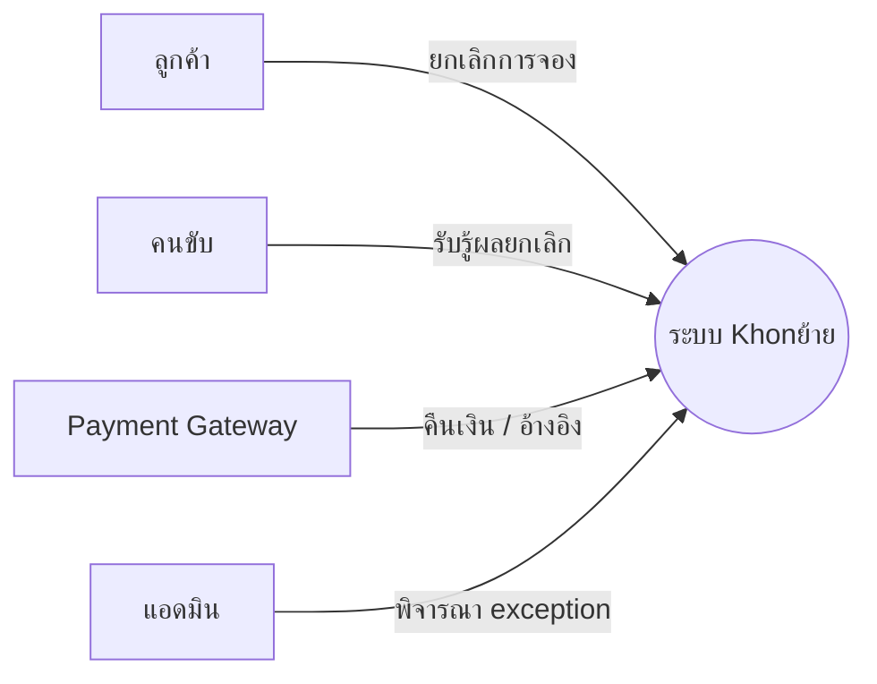
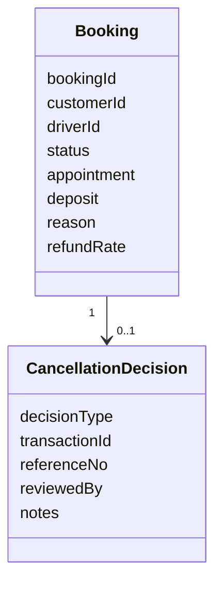
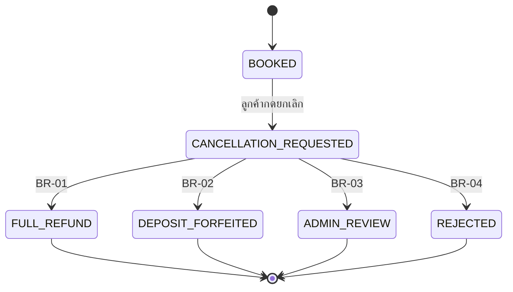
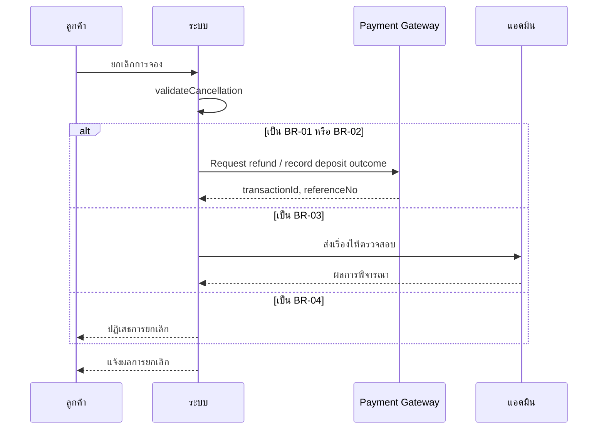

# โมเดลที่ feature นี้ใช้ (MD-CTX-01, MD-DOM-01, MD-STM-01, MD-SEQ-01)

เวอร์ชัน 1.0 เข้า Baseline B1 | เขียนด้วย Mermaid เปิดดูภาพได้บน GitHub

## MD-CTX-01 Context Diagram (เฉพาะส่วนที่ feature นี้แตะ)

## MD-DOM-01 Domain Model

## MD-STM-01 วงจรชีวิตการยกเลิก

## MD-SEQ-01 ลำดับการคุยกับระบบภายนอก

